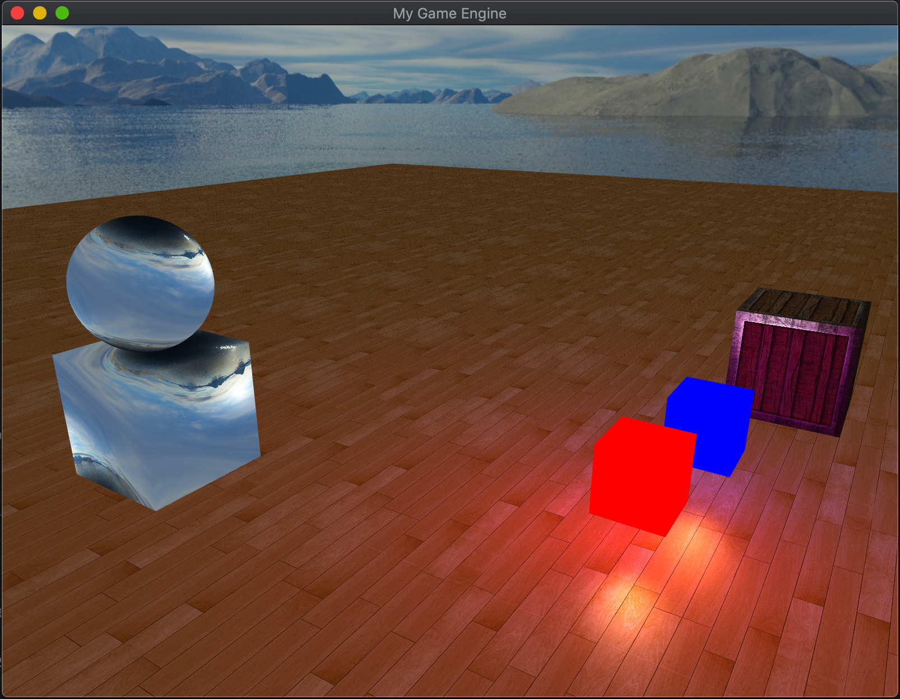
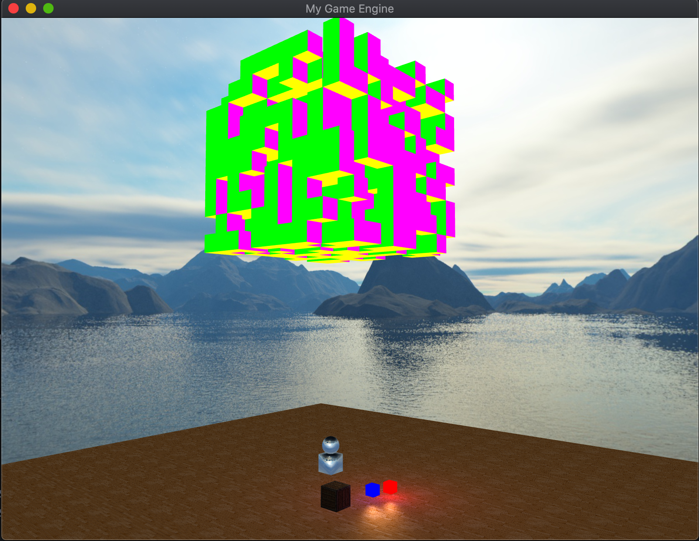

# Basic OpenGL engine in C++
This project was just about learning more about OpenGL and shaders :)
All was basically learned from this website <a href="https://learnopengl.com/Introduction">learnopengl.com</a>, Check it out!

Developped by <a href="https://twitter.com/SebMnzz">Sebastien Menozzi</a>

## Screenshots

## License

This application is released under MIT (see [LICENSE](LICENSE)).
Some of the used libraries are released under different licenses.
